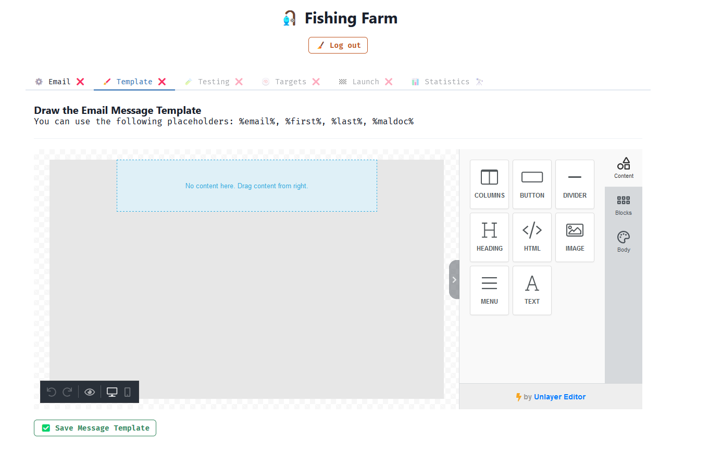

<!-- PROJECT SHIELDS -->

[![Contributors][contributors-shield]][contributors-url]
[![Forks][forks-shield]][forks-url]
[![Stargazers][stars-shield]][stars-url]
[![Issues][issues-shield]][issues-url]
[![MIT License][license-shield]][license-url]

<!-- PROJECT LOGO -->
 

  
  <h3 align="center">🎣🐟 Phishfarm</h3>
  

    A simple open source phishing platform for red teams.
     
     
    <a href="https://github.com/christoskaltsas/phishfarm/issues">Report Bug</a>
    ·
    <a href="https://github.com/christoskaltsas/phishfarm/issues">Request Feature</a>
  

<!-- TABLE OF CONTENTS -->

  
Table of Contents

  <ol>
    <li><a href="#features">Features</a></li>
    <li><a href="#built-with">Built With</a></li>
    <li><a href="#todo">TODO</a></li>
    <li><a href="#contributing">Contributing</a></li>
    <li><a href="#license">License</a></li>
  </ol>

## Features

- ✅ No database.
- ✅ Specify SMTP settings for email delivery.
- ✅ Create an email template using an editor, with dynamic placeholder support.
- ✅ Specify your campaign's targets, their email address and name, and intented
  payload.
- ✅ Specify the delivery date and time interval between deliveries.
- ❌ Enable telegram feature for live updates.
- ✅ View campaigns results in a nice dashboard.

## Built With

- [.net 6.0](https://dotnet.microsoft.com/en-us/download/dotnet/6.0)
  - [fast endpoints](https://fast-endpoints.com/)
- [react](https://reactjs.org/)

## Todo

- [x] Email Settings Specification
- [x] Template Specification
- [x] Send a Test Email
- [x] Specify Targets and Payloads
- [x] Campaign Initializion Options
- [ ] Dashboard
- [ ] Telegram
- [ ] Farm.Tests
- [ ] Fisherman tests
- [ ] Separate Repository for fisherman

## Contributing

Contributions are what make the open source community such an amazing place to learn, inspire, and create. Any contributions you make are **greatly appreciated**.

If you have a suggestion that would make this better, please fork the repo and create a pull request. You can also simply open an issue with the tag "enhancement".
Don't forget to give the project a star! Thanks again!

1. Fork the Project
2. Create your Feature Branch (`git checkout -b feature/AmazingFeature`)
3. Commit your Changes (`git commit -m 'Add some AmazingFeature'`)
4. Push to the Branch (`git push origin feature/AmazingFeature`)
5. Open a Pull Request

## License

Distributed under the GNU General Public License v3.0 License. See `LICENSE` for more information.

<!-- MARKDOWN LINKS & IMAGES -->
<!-- https://www.markdownguide.org/basic-syntax/#reference-style-links -->

[contributors-shield]: https://img.shields.io/github/contributors/christoskaltsas/phishfarm.svg?style=for-the-badge
[contributors-url]: https://github.com/christoskaltsas/phishfarm/graphs/contributors
[forks-shield]: https://img.shields.io/github/forks/christoskaltsas/phishfarm.svg?style=for-the-badge
[forks-url]: https://github.com/christoskaltsas/phishfarm/network/members
[stars-shield]: https://img.shields.io/github/stars/christoskaltsas/phishfarm.svg?style=for-the-badge
[stars-url]: https://github.com/christoskaltsas/phishfarm/stargazers
[issues-shield]: https://img.shields.io/github/issues/christoskaltsas/phishfarm.svg?style=for-the-badge
[issues-url]: https://github.com/christoskaltsas/phishfarm/issues
[license-shield]: https://img.shields.io/github/license/christoskaltsas/phishfarm.svg?style=for-the-badge
[license-url]: https://github.com/christoskaltsas/phishfarm/blob/master/LICENSE
[product-screenshot]: images/screenshot.png
